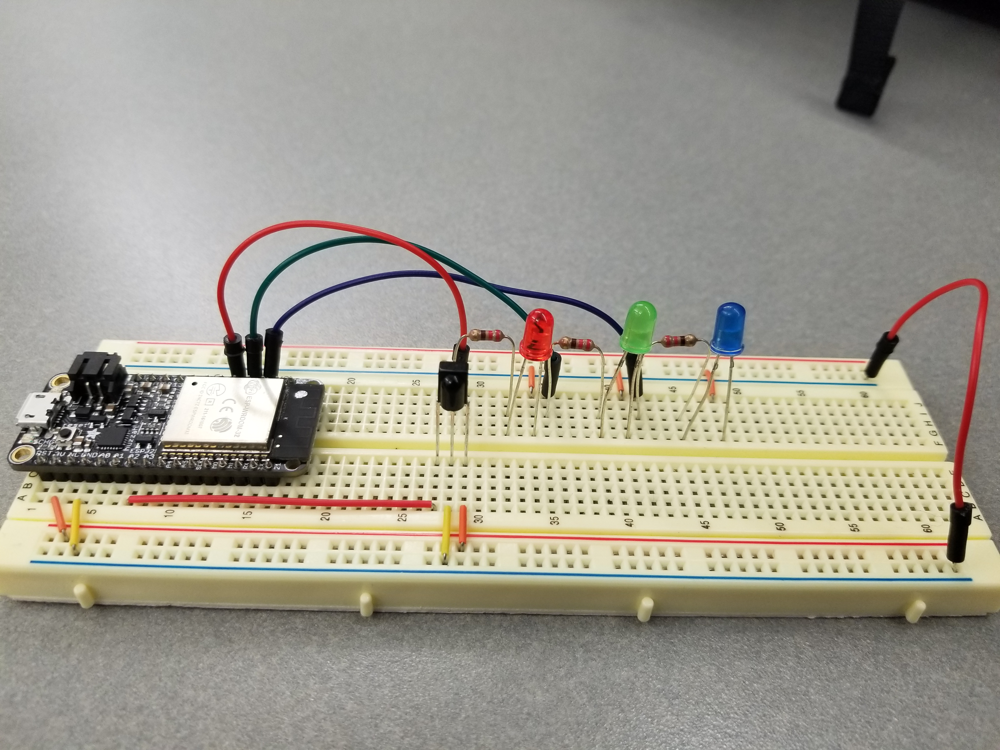

# Quest 5: Secure Key
Authors: Vindhya Kuchibhotla, Jennifer Norell, Vanessa Schuweh

2019-11-22

## Summary
In this quest, we used all of the skills assigned for this quest, as well as a few from the past quests to implement a secure key as a fob. We primarily used the IR TX/RX skill, as well as the database skill and the NodeJS skills. The goal of this quest is to be able to carry around multiple key fobs that can have authorization. When we are in range of the secure hub (a different ESP), we can press a button on the fob which will transmit a message using an IR LED over UART to the hub with the specific fob ID and its code. The hub receives this information with the IR receiver and sends the information received and its hub ID using UDP over WiFi to the Node server, hosted on the Raspberry Pi. We created two databases on the RPi, one for authorization (who should be able to access and standard information like name) and one for authentication (time stamp of accesses and to which hub). Using the databases, the fob is notified as to whether it is authorized (unlocked) or not using UDP over WiFi, indicated by the green LED on the fob. We will then log when the hub is accessed in the database with the timestamp, location, fobID, hubID, and name of the user.  The authentication logging is displayed on a client side web server. We created multiple keys to demonstrate this capability that each fob has a unique ID and can be differentiated in the database.

## Evaluation Criteria
We successfully demonstrated:

- Hosting the Level database on the Raspberry Pi Zero
- Using at least 3 fobs with unique IDs connected to the hub
- Communication between the fobs, the hub, and the web server
- Granting access from the hub to a fob and sending a confirmation message via LED
- Logging the successful attempts in the database and displaying it on the web server

## Solution Design
For this quest we had three versions of the fob code, each one running on a different ESP32 with a different code and message coming from each. The coded message is sent by using an H bridge to modulate a 38KHz RMT with the UART signal. Each fob had its unique ID and code sent as a message in this manner through its IR LED. The message includes a start byte followed by the ID then code. This is because when receiving the signal there is a lot of excess noise, so having a start byte will aid in finding the ID and Code found in data_in. Furthermore, each fob was accompanied with a Green LED to indicate "Authorized" and Blue LED indicating that the id and code was being transmitted on button press.

We also have one ESP32 with hub code flashed onto it to receive these messages and pass the information including its ID to the Node server as the UDP client. The hub includes a IR receiver which reads in the signal then identifies the start byte then send the id and code message as a JSON to be parsed.

Lastly, we have our NodeJS and html files for the server and frontend. This file passes the information received from the hub into the database.

The pins used for communication on the fob are:
- RMT Pulse - GPIO 26
- UART Transmitter - GPIO 25
- Button - GPIO 4
- Green LED - GPIO 32
- BLUE LED - GPIO 14

The pins used for communication on the hub are:
- UART Receiver - GPIO 34
- Red LED - GPIO 15
- Green LED - GPIO 32
- BLUE LED - GPIO 14

## Investigative question: comment on the security of your system.
### How would you best hack into this system if you were so inclined? How could you prevent this attack? Describe the steps.
Currently we are only using numbers to verify devices (1 is fob1, 2 is fob2, etc), so it is incredibly easy to guess what the code is and to regenerate and send to the hub to gain access. This could be made more secure by doing two things: making the ID and codes more complex and hashing or encrypting it. Additionally, we are using UDP communication which is not secure because there is no two-way verification and packets are often sent and lost. The packets are just being sent and there's no verification so packet spoofing and IP spoofing is very easy. Furthermore, the users who are authorized are stored in an authorization database (based on a text file), which ideally would also be encrypted and hosted in a more secure database. Lastly, the RPi is communicating with both the hub and the fobs though it should only be communicating with the hub. We don't want the RPi and the fobs to communicate because we only want the fobs to communicate with the hub and the hub to be the middle man and communicate with the RPi.

## Sketches and Photos
All fobs and hub setup:

Wiring of a key fob:

Wiring of the hub:

System Overview:

Screenshot of Web Client:

## Supporting Artifacts
Video Demonstration                                 

Video Presentation                                            

- [Link to repo](https://github.com/BU-EC444/Team7-Schuweh-Kuchibhotla-Norell/tree/master/quest-5/code)

## References
* [State Model](http://whizzer.bu.edu/briefs/design-patterns/dp-state-machine)
* [LevelDB](https://www.npmjs.com/package/node-leveldb)
* [Database Design Pattern](http://whizzer.bu.edu/briefs/design-patterns/dp-db)
* [UDP Client Espressif Example](https://github.com/espressif/esp-idf/tree/master/examples/protocols/sockets/udp_client)
* [Node and Sockets](http://whizzer.bu.edu/briefs/design-patterns/dp-sockets)
* [IR TX/RX](http://whizzer.bu.edu/skills/ir-tx-rx)
* [IR Comms Design Pattern](http://whizzer.bu.edu/briefs/design-patterns/dp-irtxrx)
-----

## Reminders

- Video recording in landscape not to exceed 90s
- Each team member appears in video
- Make sure video permission is set accessible to the instructors
- Repo is private
