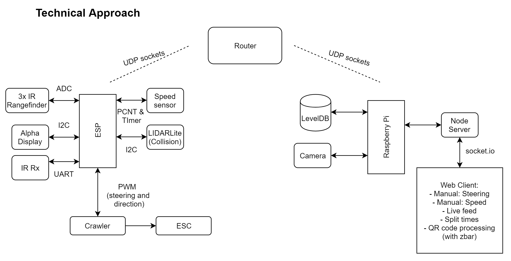

# Quest 6: Final Rollup
Authors: Vindhya Kuchibhotla, Jennifer Norell, Vanessa Schuweh

2019-12-10

## Summary
In this quest, we incorporated skills from almost all of the quests from this semester, including the skills assigned for this specific quest, specifically the Navigation and Webcam. We primarily used skills from the crawler quest, but also used IR TX/RX skills and the skills from sensor central. The goal of this quest is to autonomously drive a car through a course without any crashes or collisions, and then manually drive the crawler for the last fourth of the course to the QR code to decode and process the contents using the web camera attached to the Raspberry Pi. We did this in two primary parts: the node server and database on the Raspberry Pi and the crawler with the ESP and C code. The crawler uses rangefinding sensors on the side to avoid hitting the walls, to drive straight, to prevent front collision, and to prevent back collision. The IR receiver, the alphanumeric display, and the wheel speed sensor are also connected to the ESP on the crawler. The ESP uses UDP sockets to communicate with the node server. The node server was used for manual driving (communicating back to the ESP) and hosting the live stream that we used to both drive and to decode the QR code at the end of the course. We also wrote our split times to the database and sent the split times to the web client to display here.

## Evaluation Criteria
We demonstrated that the following tasks during our demo (Professor Little graded our demo and allowed us to take a picture of the rubric):

We particularly proved the missing processes in our video demonstration listed below:
* Manual driving
* Autonomous driving with beacon
* Alphanumeric with split time
* QR Code Scanner 

## Solution Design
For this quest, the bulk of our program is code for intializing and configuring. The important fucntionalities of our soution design runs in congruent tasks to ensure efficiency and accuracy. For example, we are continuously reading values from all sensors to gaurantee that there we have the accurate values in real time eliminating any delay that could occur. More specifially the following bulletpoints details our technical approach:
* __udp_client_task__ 
This is were we intialize udp socksts, and send a receive messages to and from the node server. What's being sent is the beacon id and split times and what's beign received is manual or automatic control messages.
* __recieve_task__ 
The receive task is similar to that of the hub in Quest5. It reads in the data and saves it into a variable. It will then iterate through the length of the incoming data until the start byte 0x1B is found then saves the proceeding bytes for color and id, respectively. Furthermore if there is no signal being received, the task will set all variables to default values (LED OFF and no data received).
* __ir_task__ 
The IR task is simply to continusously save data from 3 IR sensors attacehd to the side and rear of the car. With this we can always have the most accurate data in REAL time to ensure the crawler maintains a stright path 75cm from the wall and not collide when driving backwards
* __led_task__ 
The LED task is responsible for recording split time, displaying it onto the alphanumeric display, lighting up the corresponding LED to the code received from the beacon, and controlling the car according to the code from the beacon. When dealing with split time our program saves the current time when it receives a signal from a new beacon (determined by new beacon id) and finds the difference between the current time and the time when it passed the previous beacon. This difference in time (in seconds) is the split time between two beacons. We then perform calculations to get the time in minutes and seconds to display onto the alphanumeric. From the receive task, the color variable holds the code given by the beacons which is either red, green, yellow, or off. In this task, the color variable will light up the appropirate LED on the car. And lastly, this task will stop the car if Red is received, slow down if yellow is received, drive if green is received, or keep driving if nothing received. 
* __collision_task__ 
The collision task is responsible for continuously reading values from the LidarLite, preventing the car from colliding when driving forward or backwards, executing PID, and maintaining a straight line along the wall and 75cm away from the wall to drive in line of the beacons. The crawler has attached a LidarLite sensor at the front and 3 IR range sensors: 2 facing the right and one at the rear. Once the system detects an obstacle 175cm away, it will direct the crawler to begin slight turning until it's about to collide then stops. The crawler will then to slowly revers to the right until the rear sensor detects a wall then it will turn left to complete the turn. The process will continue until the car has sucessfuly cleared the turn then proceed align itself 75cm from the wall, run PID to try and maintain 0.2m/s, and also use the 2 side IR sensors to keep a strightpath using the wall as point of reference. When using the two sensors, the program will take the difference of the readings to adjust the crawler slightly left or right to keep a straight line.
* __speed_task__ 
The speed task continusously gets values from the optical encoder, performs calculations to convert the values to engineering units of m/s using pulse count and timers. This speed value is used when executing PID speed control when driving in a straight line.
 

That concludes all of the primary features of the tasks. The following are additional functionalities:
* __Automatic/Manual__ 
The crawler can be autonomous or manual. When in autonomous, the program will be running all the tasks mentioned above. But when the manual button on is pressed on the server, the crawler receives a message which sets the "isAuto" flag LOW to suspend all tasks and make the car fully manual. In udp_client_task if the flag is low, then it will proceed to await messages from the server instructing the car to drive forward, backward, left, or right. Each of these commands have error checks to ensure that the car can't drive faster than 700, drive slower than 1300, turn left more than 2300, or turn right more than 700. If the error checks pass then each button press will increment or decrement speed and turning.
* __QR Code Processing__ 
Regarding the web cam integration, we used both motion and zbar to host the live stream and then to decode the QR code at the end of the track. Both motion and zbar are packages that are installed on the pi. Once the packages have been installed, motion is hosted on the pi’s ip address at port 8081. this can then be embedded in the html of the web server to be viewed on our page. In order to decode the QR code, we use zbar. This is done manually. Once the QR code is in view of the web cam, we turn off motion and then turn on zbarcam. zbarcam will only run without a live stream, so we are unable to view the feed, but it waits until it sees a QR code and then decodes it. We can view this either in the terminal or a text file. Alternatively, zbar also comes with a tool called zbarimg. This tool decodes images rather than a live feed. We could have allowed motion to take continous images and run zbarimg on these images until it found a QR code and decoded it. We can then write the decoded code to either the terminal or a text file.

## Sketches and Photos
Web Client:

  

Technical Diagram:

Wiring of the Crawler:

Autonomous driving with the beacons and split times:

Steering and Turning:

## Supporting Artifacts

Video Presentation:

Video Demonstration:

## References

- Quest 4 code and references
- Quest 5 code and references
- Zbar and Web camera set up

-----
## Reminders
- Video recording in landscape not to exceed 90s
- Each team member appears in video
- Make sure video permission is set accessible to the instructors
- Repo is private
