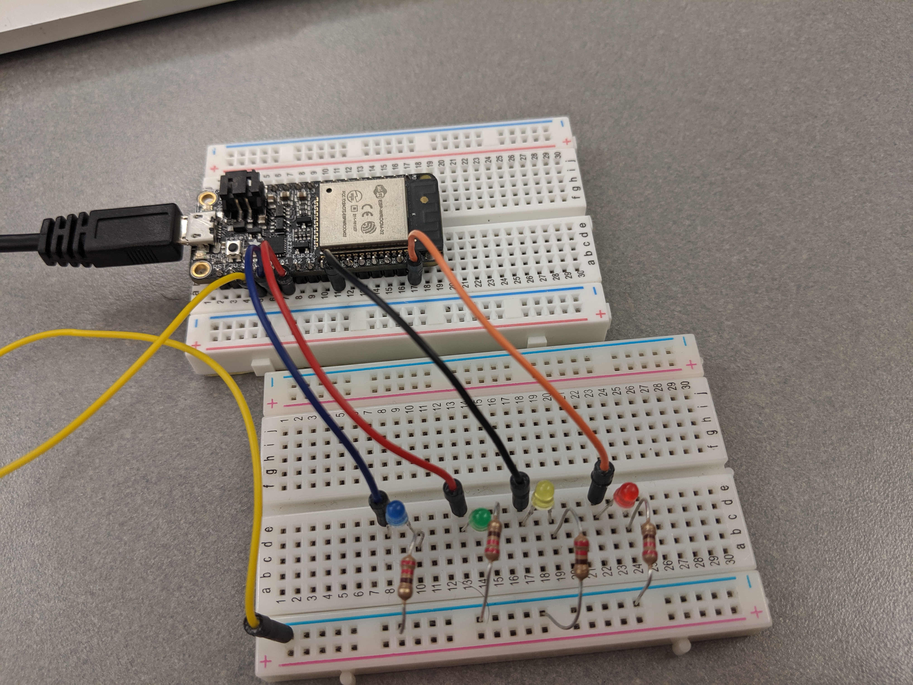

#  GPIO_LEDs

Author: Jenni Norell, 2019-09-20

## Summary
In this skill we learned how to connect the ESP32 to 4 LEDs and to make them count in binary. We simply used the board, a few wires, 4 resistors and the 4 LEDs.

## Sketches and Photos

 

## Modules, Tools, Source Used in Solution
4 LEDs
4 Resistors
ESP32

## Supporting Artifacts
Course Website Powerpoint

-----

## Reminders
- Repo is private
