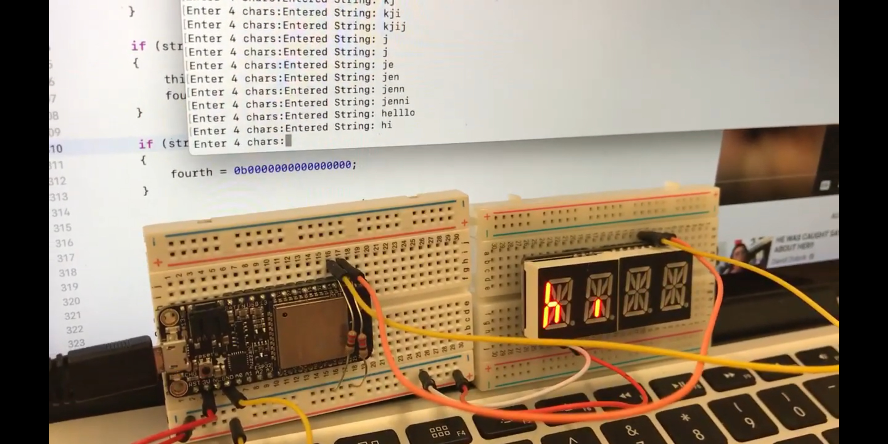

#  Alphanumeric Display

Author: Jennifer Norell, 2019-09-20

## Summary
In this skill assignment, we learned how to read inputs from the ESP32 and display them on the alphanumeric display. We did this with error checking for a maximum of 4 characters. 

## Sketches and Photos

 

## Modules, Tools, Source Used in Solution
Alphanumeric Display Board
ESP32 Board

## Supporting Artifacts

http://whizzer.bu.edu/briefs/alphanumeric
https://github.com/BU-EC444/code-examples/tree/master/i2c-display
https://github.com/adafruit/Adafruit_LED_Backpack/blob/master/Adafruit_LEDBackpack.cpp

-----

## Reminders
- Repo is private
