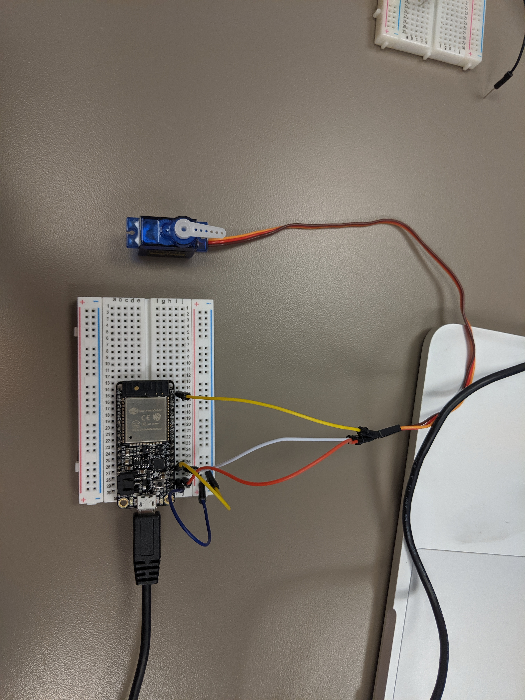

#  Servos

Author: Jennifer Norell, 2019-09-20

## Summary
In this skill, we learned how to connect to the servo to the ESP32. We did this by first reading the reference material and then experimenting with the max degree and the pulse width min and max. 

## Sketches and Photos

## Modules, Tools, Source Used in Solution
Servo
ESP32

## Supporting Artifacts

http://whizzer.bu.edu/briefs/design-patterns/dp-pwm
https://github.com/espressif/esp-idf/tree/master/examples/peripherals/mcpwm/mcpwm_servo_control

-----

## Reminders
- Repo is private
