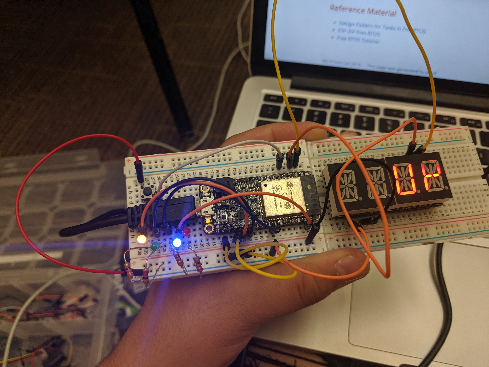
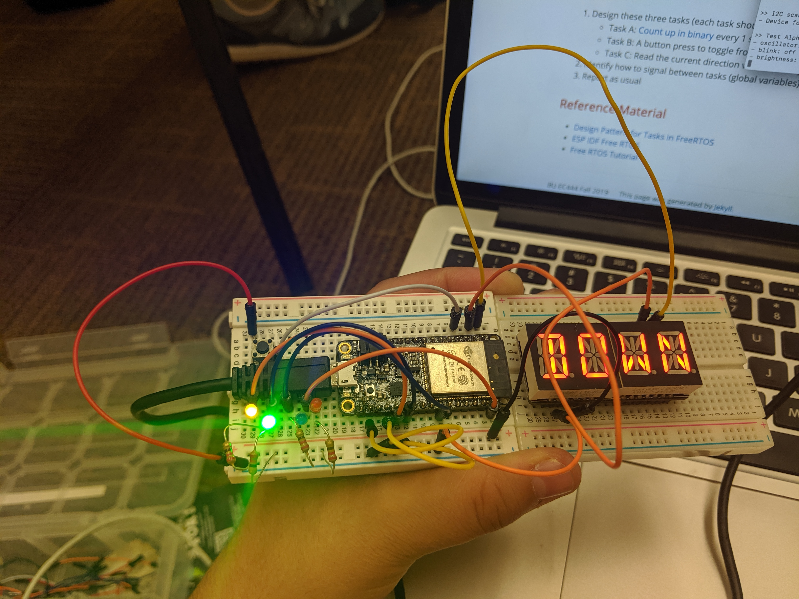

#  RTOS

Author: Jennifer Norell 2019-09-20

## Summary
In this skill assignment, we had to build a binary counter using a real time OS (RTOS). We did this by creating three functions and linking them together. We had a function that counts up and down in binary, a function that flips the direction based on a button and a function that would read the direction value and display it on the alphanumeric display. We displayed the counter with 4 LEDs which connected to the button and the display. Unfortuntately, my code was unable to work completely. Below are pictures of how it was supposed to work if it did (taken from a classmates board)

## Sketches and Photos
 
 

## Modules, Tools, Source Used in Solution
4 LEDs
Button
4 Resistors
Alphanumeric Display

## Supporting Artifacts
GPIO_LED Skill
Alphanumeric Skill

-----

## Reminders
- Repo is private
