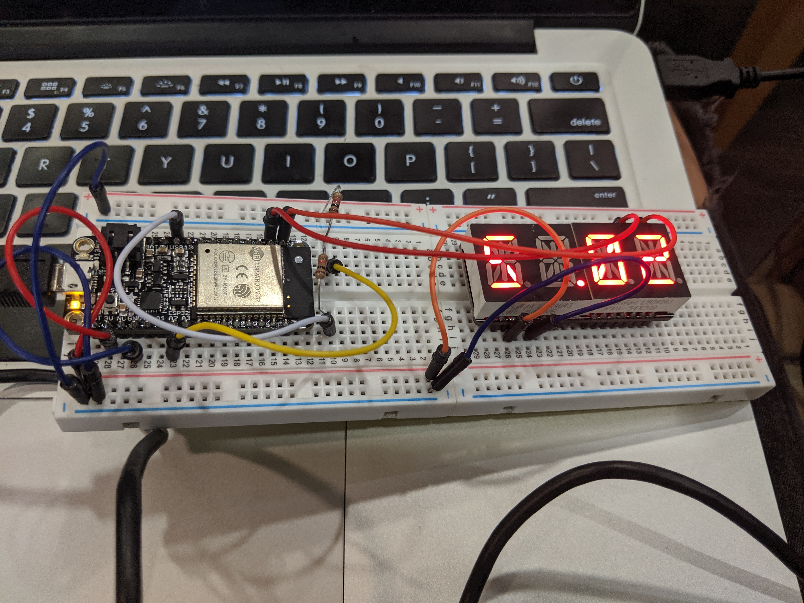

#  Battery

Author: Jenni Norell, 2019-10-08

## Summary
In this skill we built a voltage divider to create a battery monitor to measure the battery of the ESP32. We displayed these results on the alphanumeric display. 

## Sketches and Photos
 

## Modules, Tools, Source Used in Solution
Alphanumeric Display Board
ESP32 Board 
resistors

## Supporting Artifacts

https://github.com/espressif/esp-idf/tree/39f090a4f1dee4e325f8109d880bf3627034d839/examples/peripherals/adc
-----

## Reminders
- Repo is private
