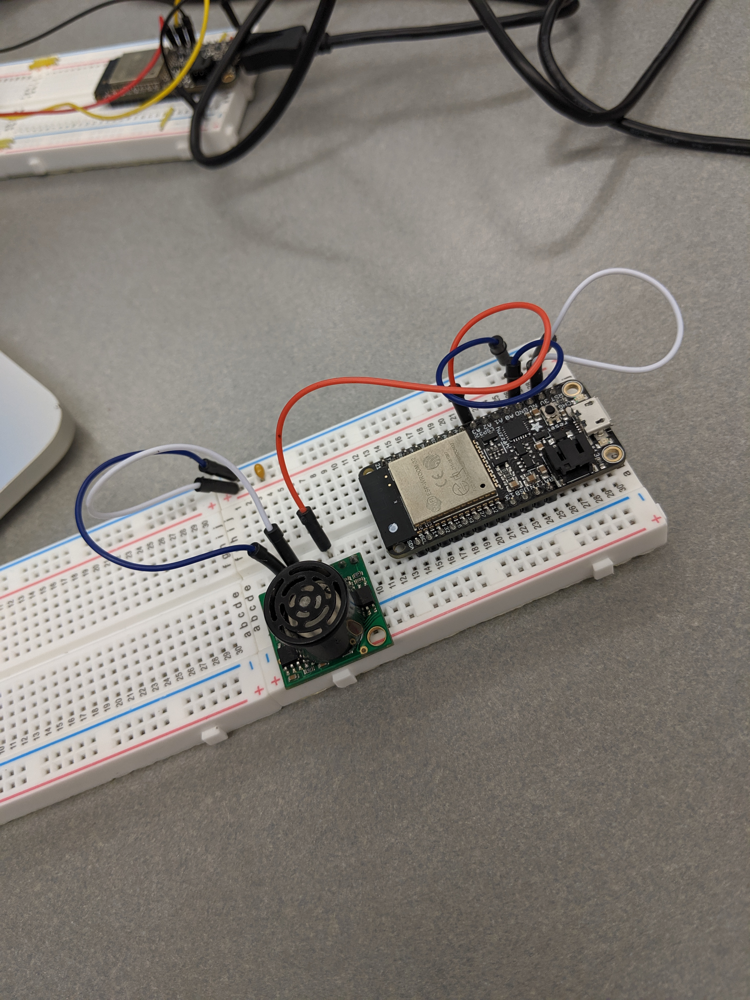

#  Ultrasonic Sensor

Author: Jennifer Norell, 2019-10-08

## Summary
In this skill we used a ultrasonic sensor to measure distance. We hooked it up to the ESP32 and wrote the code to convert the voltage to distance.

## Sketches and Photos

 

## Modules, Tools, Source Used in Solution
ESP32
Utrasonic Sensor

## Supporting Artifacts
https://www.maxbotix.com/documents/HRLV-MaxSonar-EZ_Datasheet.pdf

-----

## Reminders
- Repo is private
