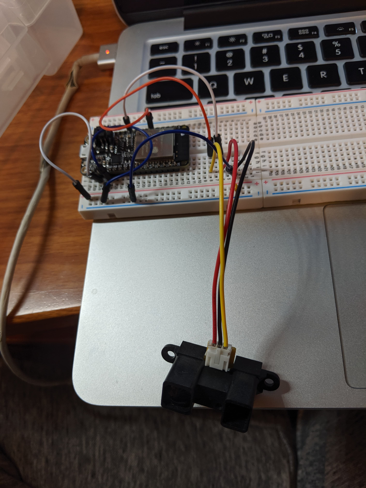

#  IR Sensor

Author: Jennifer Norell, 2019-10-08

## Summary
In this skill we used an IR Rangefinder Sensor to measure distance. It was similar to the Ultrasonic sensor, but the way in which it worked was quite different. Unfortunately, I was unable to fix it in time. Because of that, there is no demo video

## Sketches and Photos

## Modules, Tools, Source Used in Solution
IR Sensor
ESP32

## Supporting Artifacts
http://whizzer.bu.edu/skills/ir

-----

## Reminders
- Repo is private
