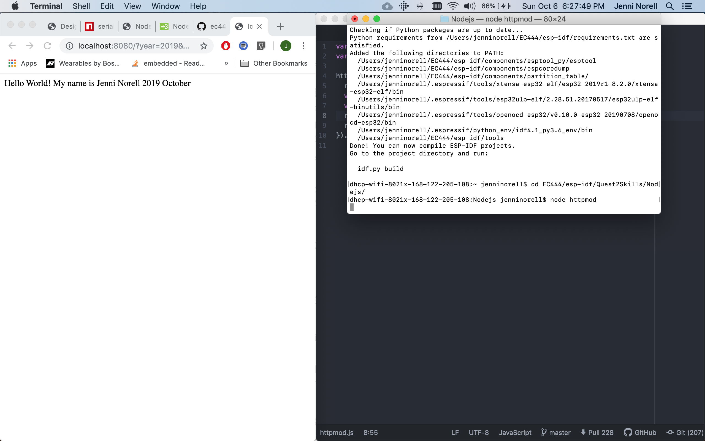
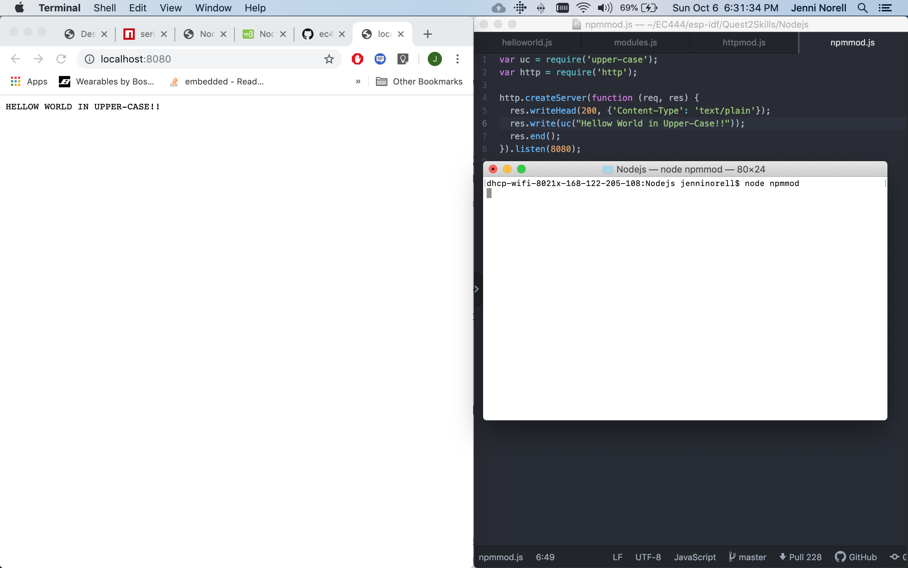
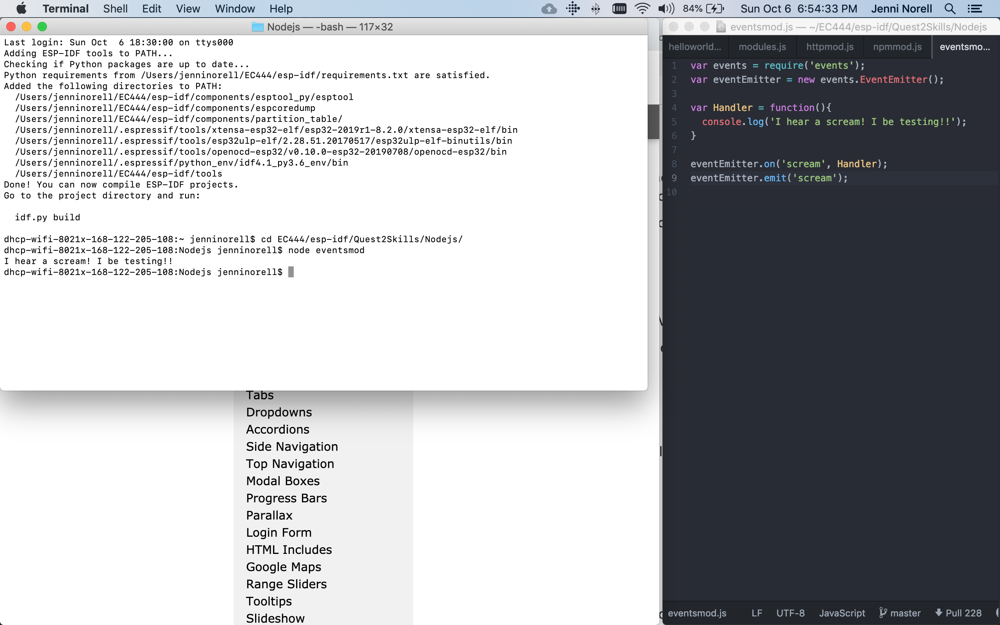
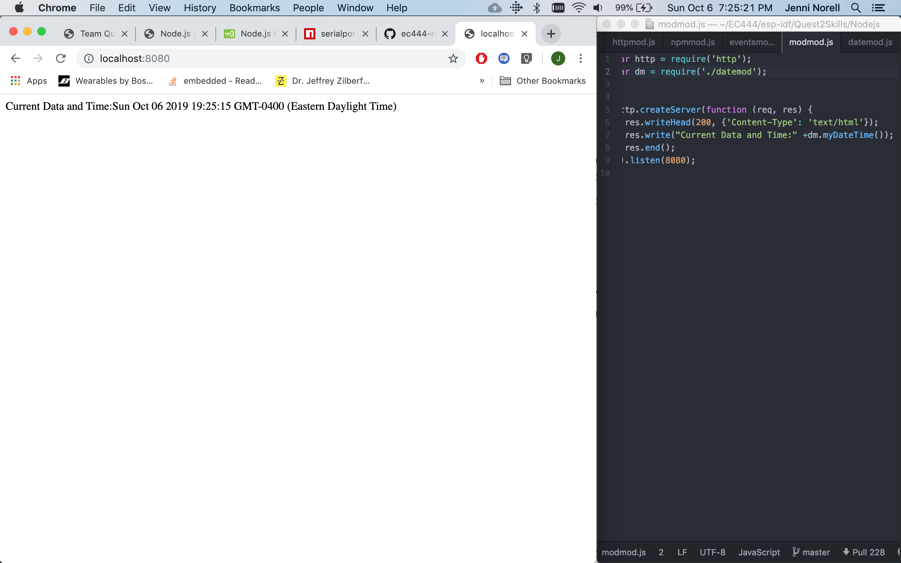

#  NodeJS

Author: Jennifer Norell, 2019-10-08

## Summary
In this skill we completed various NodeJS tutorials in order to develop basic skills needed for the quest.

## Sketches and Photos
 
 
 
 

## Modules, Tools, Source Used in Solution
https://www.w3schools.com/nodejs/default.asp

## Supporting Artifacts
NodeJS
ESP32 
sensor

-----

## Reminders
- Repo is private
