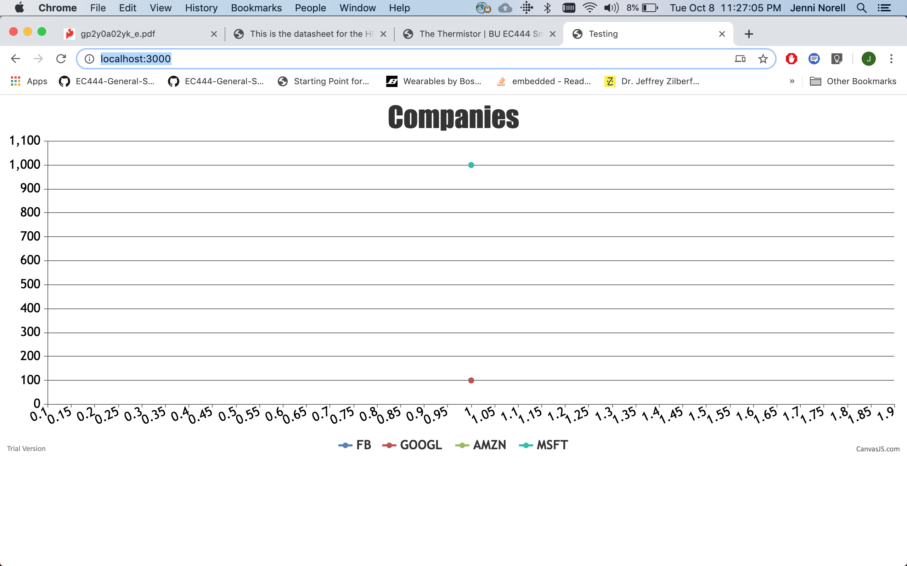

#  CanvasJS

Author: Jennifer Norell, 2019-10-08

## Summary
In this skill we used CanvasJS to printed graphs. We also used certain aspects of the NodeJS skill to assist us with this. Unfortunately, I was only able to get the graph up with a few data points. Not all of the points would display for me. 

## Sketches and Photos

## Modules, Tools, Source Used in Solution
Computer, NodeJS, CanvasJS

## Supporting Artifacts
http://whizzer.bu.edu/skills/canvasjs

-----

## Reminders
- Repo is private
