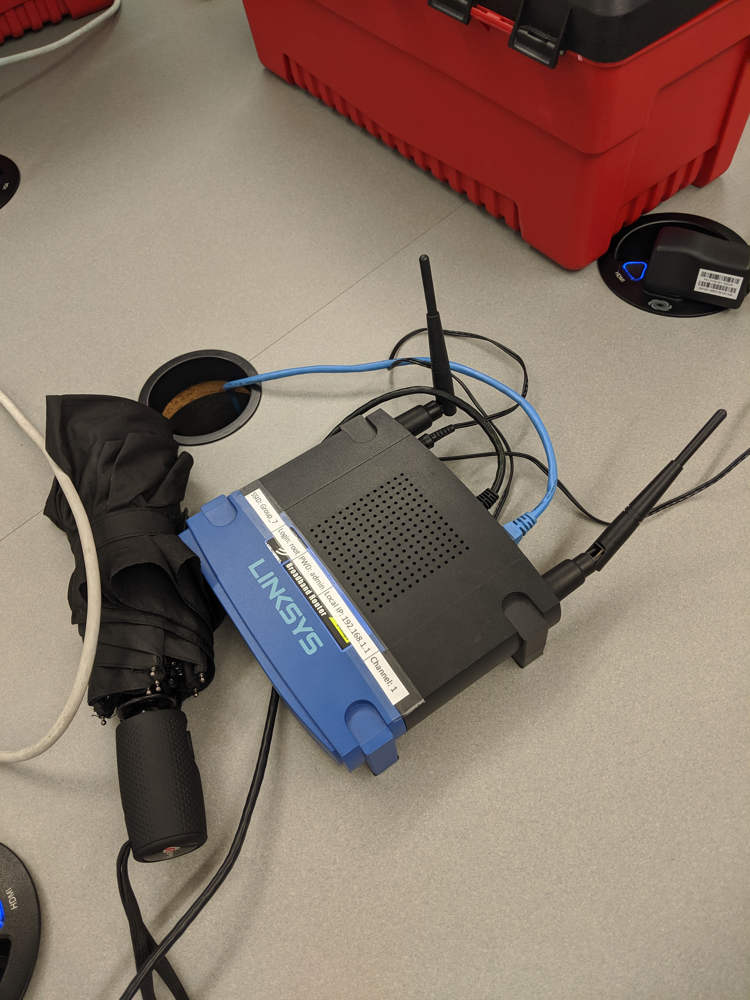

#  Router

Author: Jennifer Norell, 2019-10-10

## Summary
In this skill, we familiarized ourselves with the router and the Tomato firmware. The router that we had is the WERT54GS/GL and we used Tomato 1.28.7 for our firmware. Once we had the firmware installed we simply reflashed the router and set it up. 

## Sketches and Photos
 

## Modules, Tools, Source Used in Solution
Router
Computer
Ethernet Converter

## Supporting Artifacts
http://www.polarcloud.com/tomato
http://whizzer.bu.edu/skills/router

-----

## Reminders
- Repo is private
