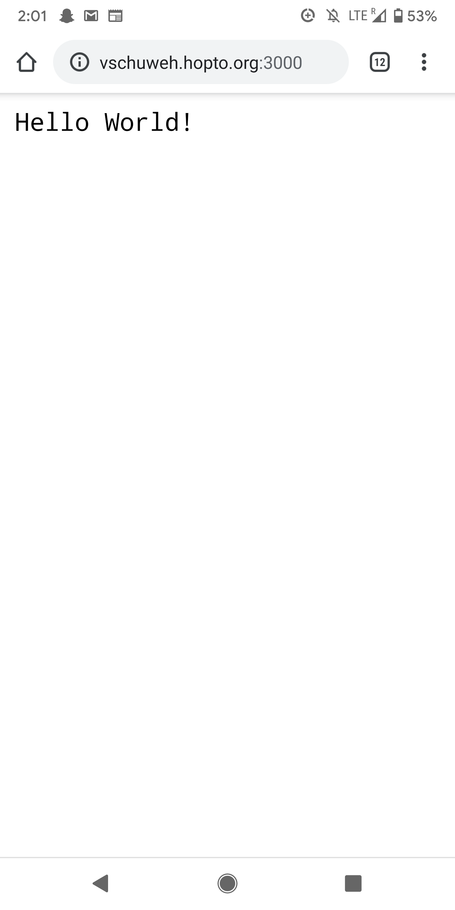
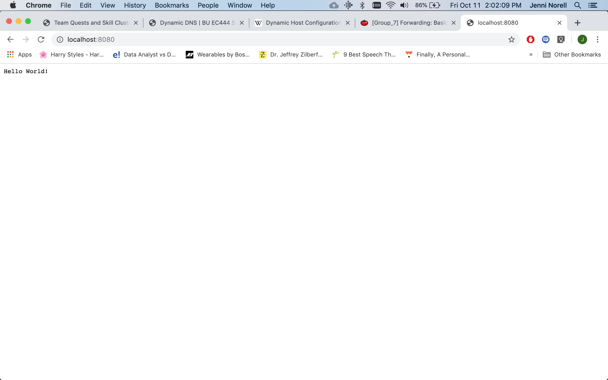

#  DDNS

Author: Jennifer Norell, 2019-10-11

## Summary
In this skill we set up a DDNS account and connected our router to it. Once this was done we set up a web server on my computer and connected to it our cellphones through the DDNS (On a different wifi network).

## Sketches and Photos
 
 

## Modules, Tools, Source Used in Solution
http://whizzer.bu.edu/skills/dyndns
Help from TAs

## Supporting Artifacts
NodeJS
Router

-----

## Reminders
- Repo is private
