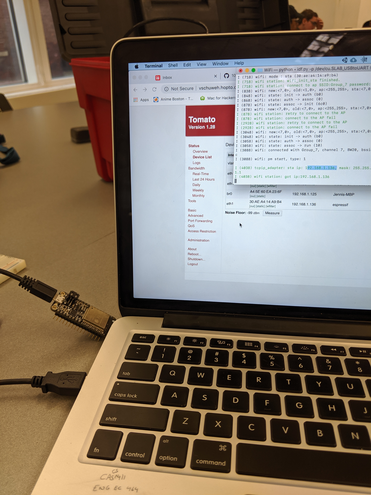

#  WiFi

Author: Jennifer Norell, 2019-10-22

## Summary
In this skill we were able to connect the ESP32 to our router. The ESP32 was assigned its own IP address on this wifi. 

## Sketches and Photos

## Modules, Tools, Source Used in Solution
ESP32
Router

## Supporting Artifacts
http://whizzer.bu.edu/skills/wifi

-----

## Reminders
- Repo is private
