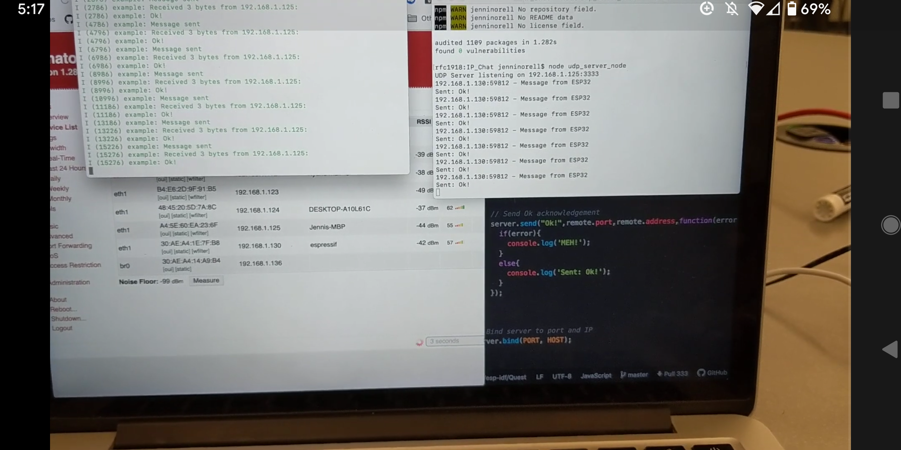

#  IP Chat

Author: Jennifer Norell, 2019-10-23

## Summary
In this skill, we demonstrated basic communication between the ESP32 and our laptop. We simply created a small dialogue between these in two seperate terminal windows. 

## Sketches and Photos

## Modules, Tools, Source Used in Solution
ESP32
Laptop

## Supporting Artifacts
http://whizzer.bu.edu/briefs/design-patterns/dp-sockets

-----

## Reminders
- Repo is private
