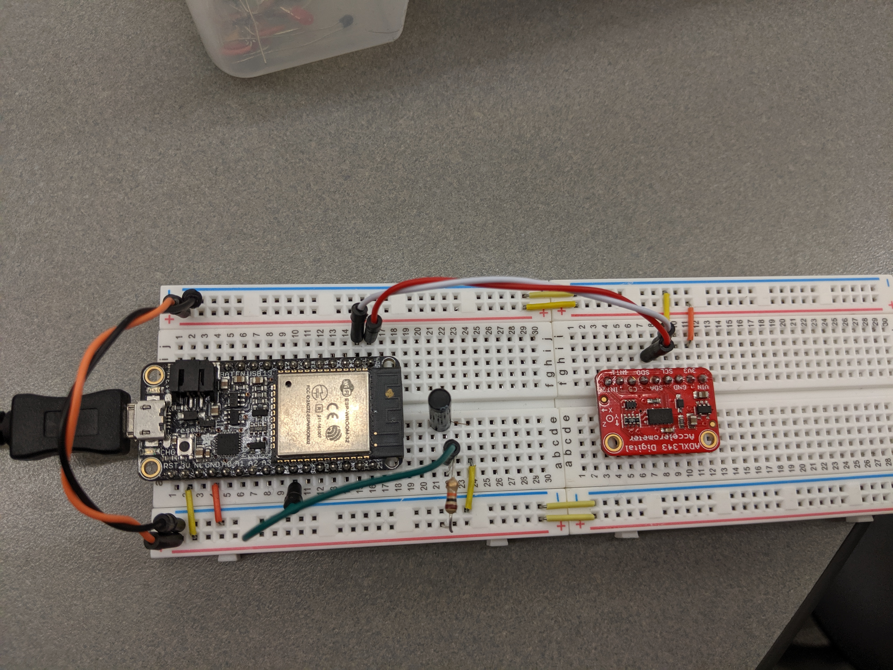

#  Accelerometer

Team Members: Vanessa Schuweh, Jennifer Norell, Vindhya Kuchibhotla, 2019-10-22

## Summary
In this skill, we wired up an ADXL343 accelerometer to an ESP32 to get tilt angles. We started with the ADXL343 base code and modified it to include ADXL343 functions to write and read from registers and read from a 16bit register. We also added the equation for the calcRP() function to convert x,y,z static acceleration values to tilt angles (roll and pitch).

## Sketches and Photos

## Modules, Tools, Source Used in Solution
ESP32
ADXL343

## Supporting Artifacts
http://whizzer.bu.edu/briefs/design-patterns/dp-i2c
https://docs.espressif.com/projects/esp-idf/en/latest/api-reference/peripherals/i2c.html
https://wiki.dfrobot.com/How_to_Use_a_Three-Axis_Accelerometer_for_Tilt_Sensing

-----

## Reminders
- Repo is private
