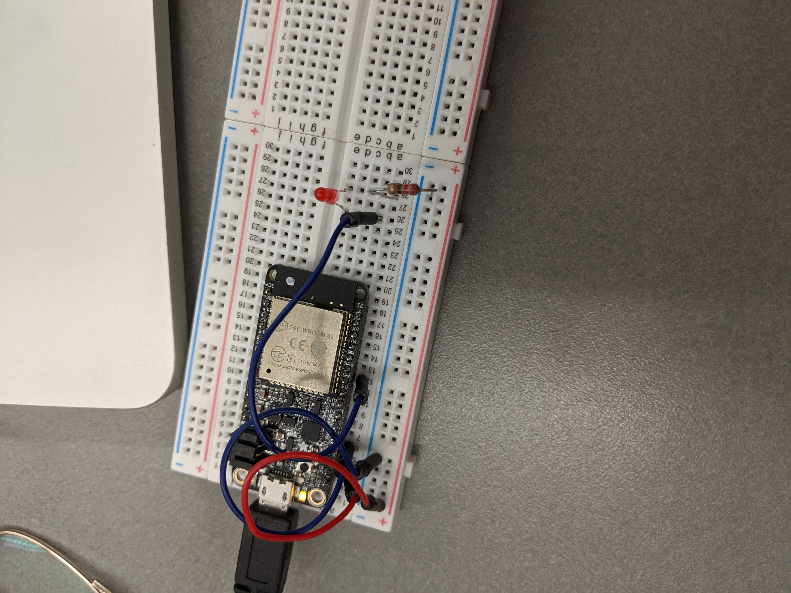

#  LED with PWM

Author: Jennifer Norell, 2019-10-22

## Summary
In this skill, we controlled an LED using pulse width modulation. We built two functions, one that automatically incremented through the intensity levels both up and down and one that incremented based on user input.

## Sketches and Photos

## Modules, Tools, Source Used in Solution
ESP32
Single LED and resistor

## Supporting Artifacts
https://docs.espressif.com/projects/esp-idf/en/latest/api-reference/peripherals/ledc.html
http://whizzer.bu.edu/skills/pwm-for-leds

-----

## Reminders
- Repo is private
