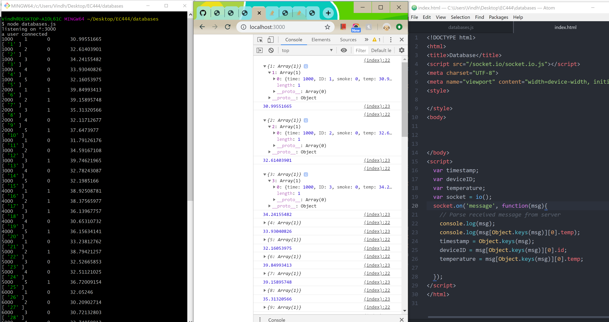
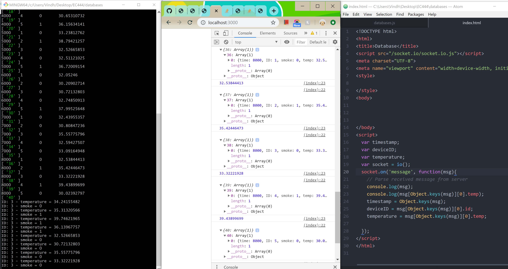

#  Persistence and Databases
Team 7 Skill
Authors: Vindhya Kuchibhotla, Jennifer Norell, Vanessa Schuweh, 2019-11-22

## Summary
In this skill, we used LevelDB (a key/value database) with Node.js interface to log and retrieve data from smoke.txt. Since the smoke.txt file does not contain unique values to use as the key, we used a classic iterator (i) as the key. The "value" included the sensor ID, temperature, timestamp, and smoke. These values were put into the database. Using sockets, this information was emitted to the html client side and printed to the console. As an example of reading from the database, we read all smoke and temperature values for sensor ID 3 and printed them to the Node server console.

## Sketches and Photos
Screenshot of putting smoke.txt data into a db. The values are printed to the console and are also emitted to the html client side to print on the console.

Screenshot of getting smoke and temperature values for sensor ID value of 3. The values are printed to the server console. The ID of 3 is hard coded in, but can be passed into the getData function.

## Modules, Tools, Source Used in Solution
- [Node LevelDB](https://www.npmjs.com/package/node-leveldb)
- Socket.io

## Supporting Artifacts
- [Design Pattern for Databases and Visualizations](http://whizzer.bu.edu/briefs/design-patterns/dp-db)
- [LevelDB add-ons documentation](https://github.com/Level/levelup)

-----

## Reminders
- Repo is private
