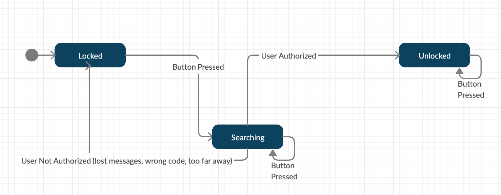
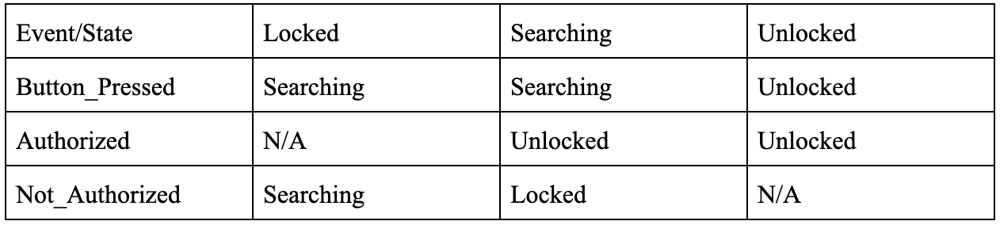

#  State Models

Author: Vindhya Kuchibotla, Jennifer Norell, Vanessa Schuweh, 2019-11-21

## Summary
In this skill, we created a state model and a state table for our quest 5. There are three distinct states (locked, unlocked and searching) and various events that cause us to move between states. The events include button pressed, user authorized, and user not authorized. Some of these events are triggered by certain things. For example, user not authorized occurs if there is lost code or if the code is wrong.  Below is the state diagram and the associated state table. 

## Sketches and Photos
 

 

## Modules, Tools, Source Used in Solution
Used our plan for quest 5 to create this

## Supporting Artifacts
http://whizzer.bu.edu/briefs/design-patterns/dp-state-machine

-----

## Reminders
- Repo is private
