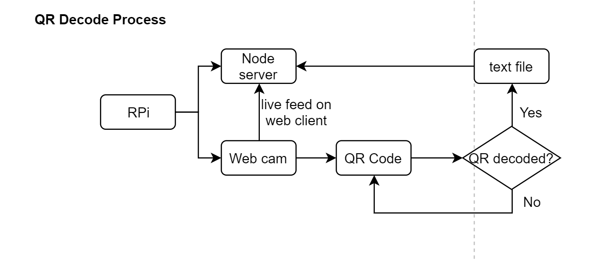

#  Skill Name
    
Team 7 Skill Authors: Vindhya Kuchibhotla, Jennifer Norell, Vanessa Schuweh, 2019-12-10

## Summary
In this skill, we determined the independent tasks needed for executing Quest 6 and outlined flowcharts with the logic of the new tasks that we are implementing. The TAs approved of our process during class and helped us improved our model. We have attached a video with voiceovers explaining our process and the flowcharts separately for reference.

## Sketches and Photos
Video Presentation:

Tasks for Quest 6:

Autonomous Process with Beacons:

Steering Autonomously:

QR Decode Process:

## Modules, Tools, Source Used in Solution

## Supporting Artifacts

-----

## Reminders
- Repo is private
